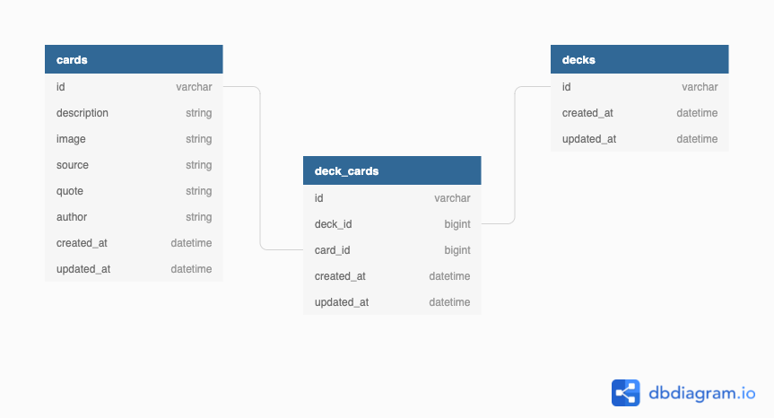

# README

This README would normally document whatever steps are necessary to get the
application up and running.

Things you may want to cover:

* Ruby version 
  - (2.5.3p105)

* System dependencies 
  - (rails 6.1.4)

* Existing database design

* Initial Set-Up
  - From your command line run the following:
    1. rails db:{create,migrate}
    2. bundle exec figaro install (you will need this file to put your API key)
    3. bundle install
    4. bundle update

* Database initialization

* How to run the test suite

* Services (job queues, cache servers, search engines, etc.)

* Deployment instructions

* ...
