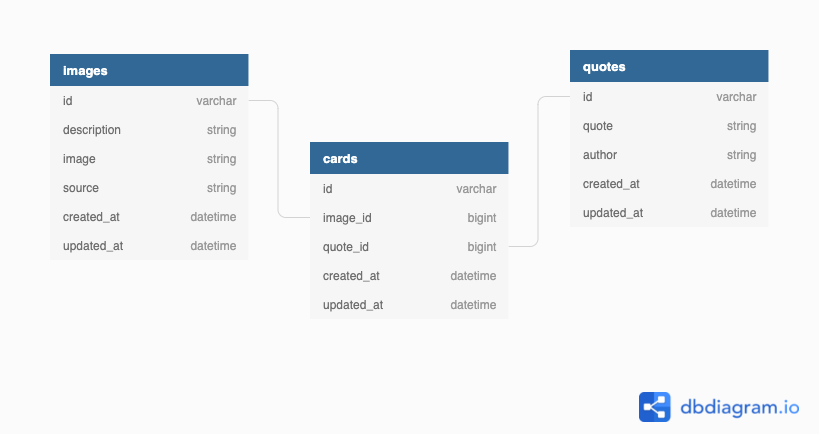

# Daily Inspirations (aka Card Shuffler)


## Overview

The scope of this application was to design and implement a card shuffler using the language of my choice.
I chose to create a rails monolith application that provides daily inspiration cards with quotes and animal images. The user can use the `shuffle` button to view a new card.


<!-- #### Add heroku link here once deployed -->

## Table of Contents
  - [Design](#design)
  - [Setup](#setup)
  - [Schema](#schema)
  - [Testing](#testing)
  - [Author](#author)


## Design

This application is a rails monolith implementing MVC (model-view-controller), Service, and Facade design principles. This application consumes two APIs - [Unsplash](https://unsplash.com/documentation#search-photos) and [Zen Quotes](https://premium.zenquotes.io/zenquotes-documentation/).

## Setup
### Prerequisites
These set up instructions are for Mac OS.

This application requires the use of `ruby 2.5.3p105` and `rails 6.1.4`.
The database was created using `PostgreSQL`.

### Check for correct versions

1. Verify your machine has the correct version of Ruby installed (2.5.3p105).  You can check this by entering `ruby -v` from the command line.
    - To install, enter `rbenv install 2.5.3p105` from the command line.   

2. Verify your machine has the correct version of Rails installed (6.1.4).  You can check this by entering `rails -v` from the command line.
    - To install, enter `gem install rails -v 6.1.4` from the command line.

### Local Repo Setup

1. Fork & Clone [this](https://github.com/dcoleman21/Card_shuffler) repository
2. From your command line `cd` into your cloned repository
3. From your command line run `bundle install`
4. From the command line run `rails db:{create,migrate}` to set up your database

### Unsplash API

1. [Go Here](https://unsplash.com/documentation#creating-a-developer-account) and follow the instructions to obtain your API Key.

### Zen Quote API

1. This API does not require an API Key

### Authorizing the Application
1. From your command line run `bundle exec figaro install` to set up an `application.yml` file to keep your credentials secure
2. You will need to add your API Key to the `application.yml` file as an environment variable:
  ```
  UNSPLASH_CLIENT_ID: <add your client id here>
  UNSPLASH_CLIENT_SECRET: <add your cliend secret here>
  ```

[back to top](#table-of-contents)

## Schema



## Testing
Run `bundle exec rspec` to see all test. You should see all passing tests

### To see the application locally
1. In your terminal press `command T` to open a new window
2. In the command line type `rails s`
3. In your web browser type `localhost:3000`, this will take you to the `Welcome Page`

[back to top](#table-of-contents)

## Author

- **Dani Coleman** - [GitHub](https://github.com/dcoleman21) - [LinkedIn](https://www.linkedin.com/in/dcoleman-21/) - [Portfolio](https://terminal.turing.edu/profiles/601)
